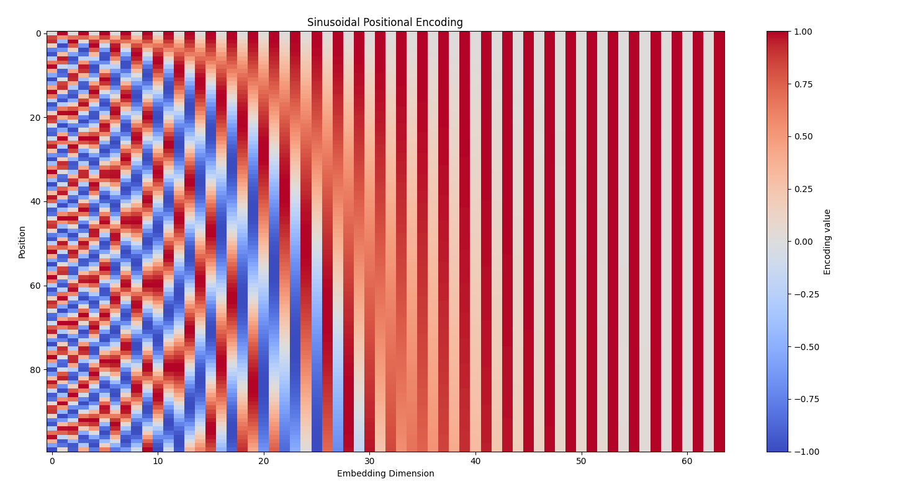
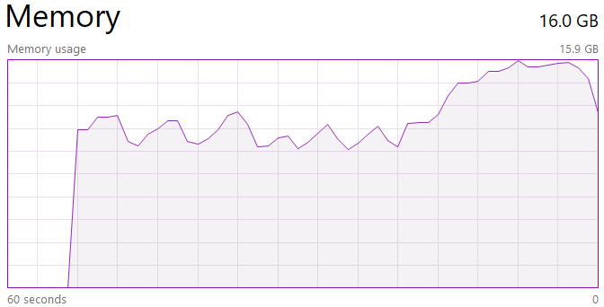

# Introduction

本文简要介绍 TransformerClassifier 的使用方法及其基本实现原理。

`TransformerClassifier` 是一个用于 PIQA 数据集的二分类器，可以接入标准的 PIQA Data Loader 数据进行训练。

# 实现原理

由于 PIQA 任务为简单的序列二分类任务，不涉及序列生成，因此不与要 Decoder，在架构上只需要 Encoder + 线性分类头 即可实现。关键组件：

- Endocer: 使用 Pytorch 提供的 **多头注意力** 组件作为一个个 Encoder 的层，整个 Encoder 包含若干个结构一致的多头注意层
- Linear Classifier：线性分类头将编码好的固定长度的序列映射为 Logits（目前暂定序列长度为 `Encoding_Dim`）

## Encoder

Encoder 接收 Token ID 序列，在 `model.encode()` 中进行：

- Embedding：将 ID 映射为向量，并添加 Positional Embedding 信息；Positional Embedding 使用经典的 Sinusoidal Positional Encoding 算法，因此位置编码本身不包含可训练参数
- Transformer Encoder- 把 Embedding 送入一个个多头注意力层，进行语义更新和特征提取
- 将更新好的语义进行 Mean Polling，把每个 Batch 中的序列 Embedding 转为一个固定长度的向量，作为这个序列最终的语义表示

随后语义向量被送入 Linear Classifier 进行评分，返回评分的 Logits，后续可以用于计算交叉熵。

Sinusoidal Positional Encoding 的位置可视化图如下：



## Classification

对于 PIQA 中的每个样本，模型分别对 Goal 和两个 Candidate Solution 进行编码。

得到：

```
Goal Representation:
[B, D]

Solution Representations:
[B, 2, D]
```

随后将 Goal Representation 分别与两个 Candidate Solution 的表示进行拼接：

```
[B, 2, D] + [B, 2, D]
        ↓
[B, 2, 2D]
```

最后通过 Linear Classifier 为两个 Candidate 分别生成一个 Logit：

```
[B, 2, 2D]
      ↓
[B, 2, 1]
      ↓
[B, 2]
```

最终输出的 [B, 2] 表示两个 Candidate 的分类 Logits，可以直接用于 CrossEntropyLoss。

# 初始化

```python
from scripts.models.transformer_bi_classifier import TransformerClassifier
import torch.optim as optim
import torch.nn.functional as F

tf_model = TransformerClassifier(vocab_size=tokenizer.vocab_size(),
                                 embedding_dim=params['embedding_dim'],
                                 padding_idx=tokenizer.pad_id(),
                                 max_seq_length=2048,
                                 num_heads=params['num_heads'],
                                 num_layers=params['num_layers'])

tf_optimiser = optim.SGD(params=tf_model.parameters(), lr=params['learning_rate'])
criterion = F.cross_entropy
```

各参数含义如下：

| 参数 | 来源 | 含义 |
|---|---|---|
| `vocab_size` | `tokenizer.vocab_size()` | Tokenizer 的词表大小，决定 Embedding 层可以接收多少种不同的 Token ID。 |
| `embedding_dim` | `params['embedding_dim']` | Token Embedding 的维度，同时也是 Transformer 的 `d_model`。决定每个 Token 使用多少维向量表示。 |
| `padding_idx` | `tokenizer.pad_id()` | Padding Token 的 ID。Embedding 层不会更新该位置对应的向量；同时用于识别并屏蔽 Padding Token。 |
| `max_seq_length` | `2048` | Sinusoidal Positional Encoding 支持的最大序列长度。当前设置为 2048，表示模型最多为前 2048 个位置生成位置编码。 |
| `num_heads` | `params['num_heads']` | Multi-Head Self-Attention 的注意力头数量。多个 head 可以从不同的表示子空间学习 Token 之间的关系。 |
| `num_layers` | `params['num_layers']` | Transformer Encoder Layer 的数量。每增加一层，都会对上一层产生的 Token 表示进行进一步的特征提取。 |

其中有一个重要约束：

```text
embedding_dim % num_heads == 0
```

因为 Multi-Head Attention 会将 `embedding_dim` 分割到不同的 attention heads 中，因此 Embedding Dimension **必须是头数的整数倍**。

# 训练

模型可以直接接入项目定义的标准数据进行训练：

```python
from time import perf_counter

tf_model.train()

epoch_loss = 0.0

for goal_ids, goal_mask, sol_ids, sol_mask, labels in train_loader:

    start_ts = perf_counter()
    # Forward
    tf_optimiser.zero_grad()

    logits = tf_model.forward(goal_ids, goal_mask, sol_ids, sol_mask)

    # Loss
    loss = criterion(
        input=logits,
        target=labels
    )

    # Backward
    loss.backward()

    tf_optimiser.step()

    # Record loss
    epoch_loss += loss.item()

    end_ts = perf_counter()
    time_elips = end_ts - start_ts
    
    print(
        f"B={sol_ids.shape[0]}, "
        f"Lg={goal_ids.shape[1]}, "
        f"Ls={sol_ids.shape[2]}, "
        f"time={time_elips:.2f}s"
    )
```

其中：

- B：当前 Batch Size
- Lg：当前 Batch 中 Goal 的最大序列长度
- Ls：当前 Batch 中 Candidate Solution 的最大序列长度
- time：该 Batch 完成一次 Forward + Backward + Optimizer Step 所需的时间

由于 DataLoader 使用 Dynamic Padding，因此不同 Batch 的 Lg 和 Ls 可能不同。

注意：在自己的 PC 上进行训练时，不要将数据的 Batch Size 设置太高（推荐 200），否则**极易造成内存溢出**。



# Q & A

## 如何获得注意力矩阵

方法一：自己取出注意力投影矩阵，之后自己给 Embedding 进行一次手动计算注意力

```python
# 取出注意力投影矩阵
W_Q, W_K, W_V = attn.in_proj_weight.chunk(3, dim=0)

print(W_Q.shape)
print(W_K.shape)
print(W_V.shape)

# torch.Size([100, 100])
# torch.Size([100, 100])
# torch.Size([100, 100])
```

这种方法可以帮助理解 Transformer 内部的计算过程，但实现较为复杂，而且需要自行处理 Multi-Head 的拆分、缩放、Softmax、Mask 等逻辑。

方法二：利用原 Encoder，手动进行 Forward 计算

PyTorch 的 nn.MultiheadAttention 本身支持直接返回 Attention Weights。

**该方法目前还在研究当中，稳定后会第一时间 Push 上代码库。**

## 如何针对该模型进行消融实验

施工中 🚧